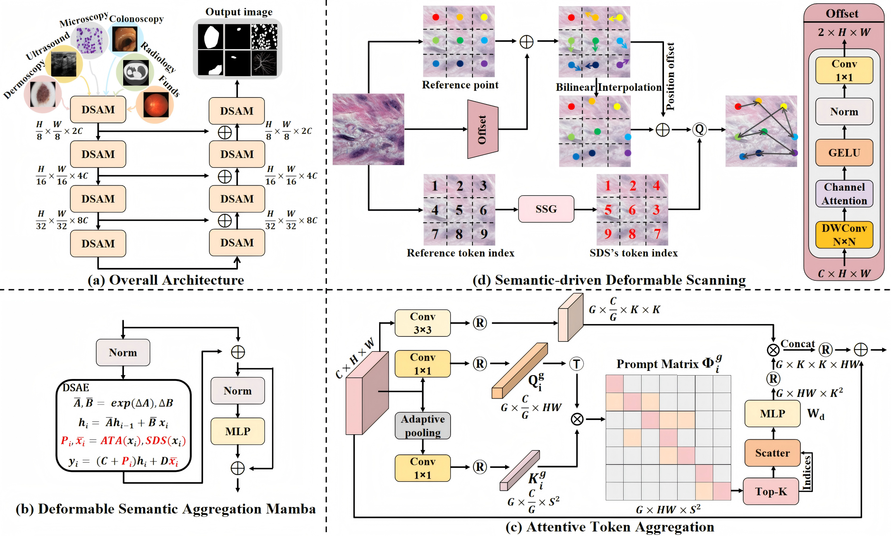

# DeSegaMamba

## DeSegaMamba: Rethinking Vision Mamba Design for Medical Image Segmentation

This repository contains the implementation of **DeSegaMamba** (Deformable Semantic Aggregation Mamba) for medical image segmentation.



## Overview

DeSegaMamba rethinks the Vision Mamba design paradigm by introducing two key innovations:

- **Semantic-driven Deformable Scanning (SDS)**: Reorganizes visual sequences based on semantic similarity rather than spatial locality
- **Attentive Token Aggregation (ATA)**: Provides non-causal prompts to enhance state space modeling

## Key Features

- **Efficient State Space Modeling**: Leverages Mamba's selective state space mechanism for long-range dependencies
- **Semantic-Aware Processing**: SDS module groups semantically similar tokens for more effective processing
- **Contextual Enhancement**: ATA module provides global context to guide the segmentation process
- **Medical Image Optimized**: Specifically designed for medical image segmentation tasks

## Architecture

The model consists of:
- **Encoder**: 4-stage hierarchical feature extraction with DSAM blocks
- **Decoder**: 4-stage upsampling with skip connections
- **DSAM Block**: Core building block combining SDS, ATA, and Mamba mixer
- **Patch Embedding**: 4×4 patch size for 512×512 input images

## Dataset Support

- ISIC 2018 (default)
- ISIC 2017
- Configurable for other medical imaging datasets

## Quick Start

### Installation
```bash
pip install -r requirements.txt
```

### Training
```bash
python train.py
```

### Configuration
Modify `configs/config_setting_DSAM.py` for your specific requirements.

## License

This project is licensed under the MIT License - see the LICENSE file for details.